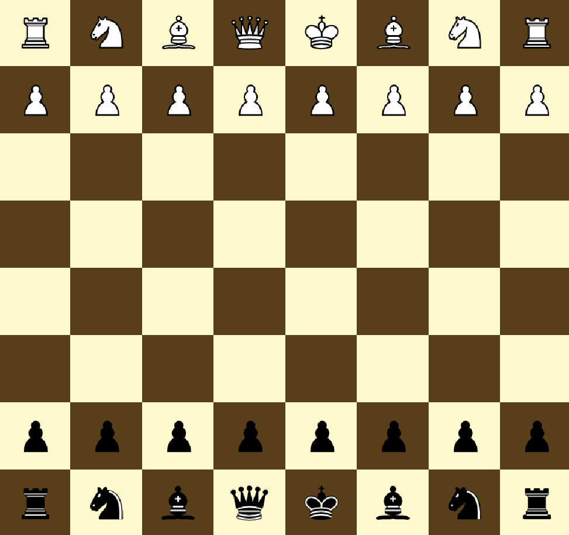
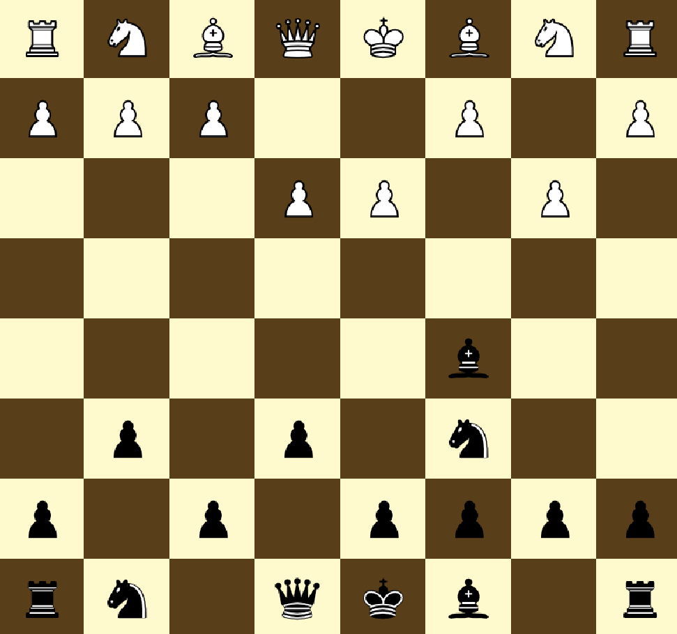

# Chess Engine

A robust Java-based chess engine that adheres to standard chess rules, enabling two players to engage in a full chess game.

## Table of Contents

- [Features](#features)
- [Project Structure](#project-structure)
- [OOP Principles and Design Patterns](#oop-principles-and-design-patterns)
- [Key Classes](#key-classes)
- [Visuals](#visuals)
- [Usage](#usage)


## Features

- Comprehensive implementation of standard chess rules.
- Calculation of legal moves for each chess piece.
- Detection of check, checkmate, and stalemate conditions.
- Support for castling.
- Extensible architecture for future enhancements.

## OOP Principles and Design Patterns

This project employs several design patterns and OOP concepts, including:

- **Builder Pattern:** Used for creating complex objects like the chessboard and pieces.
- **Factory Pattern:** Creates pieces based on their type, promoting loose coupling.
- **Strategy Pattern:** Implements different movement strategies for various pieces.

### Design Patterns

- **Factory Pattern**: Used to create instances of pieces based on game state.
- **Strategy Pattern**: Employed in the movement calculation of pieces, allowing for interchangeable algorithms.
- **Observer Pattern**: Facilitates the notification of game state changes, such as check and checkmate conditions.

## Project Structure

| Package  | Description                                   |
|----------|-----------------------------------------------|
| `board`  | Manages the chessboard and square placements. |
| `logic`  | Contains the logic for moves and game rules.  |
| `pieces` | Defines chess pieces and their movement rules. |
| `player` | Manages players and game states.               |

## Key Classes

- **Square:** Represents a square on the chessboard.
- **Piece:** Base class for all chess pieces.
- **Player:** Manages player actions and game state.
- **Board:** Represents the chessboard and the current game state.
- **Moves:** Encapsulates the movement logic for pieces.

## Visuals

Below are some visuals that showcase the chess engine in action:

### Chessboard Example

*An example of the chessboard state during gameplay.*

### Game Flow and Piece Movement

*Illustration of the move flow and game progression.*

## Usage

To run the chess engine:

1. Clone the repository:
   ```bash 
   git clone https://github.com/Mahmoud-Khawaja/Chess-Engine
2. Navigate to the project directory:
   ```bash 
   cd Chess-Engine
3. Compile the project:
   ```bash 
   javac src/com/chess/engine/*.java
3. Run the application:
   ```bash 
   java com.chess.engine.Main
